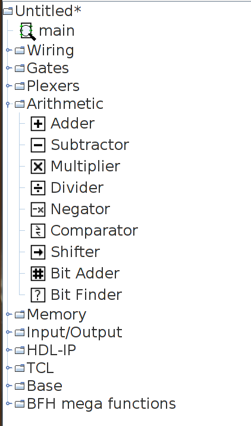
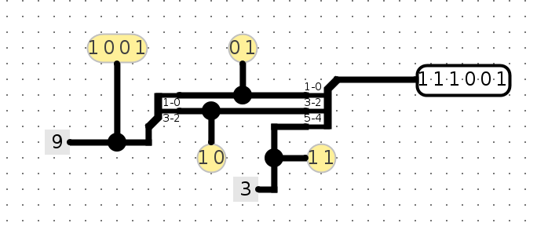

# Куем железо
Вся работа в этой лабораторной работе будет выполняться с помощью программы моделирования цифровой логики `Logisim Evolution` , которую можно найти среди файлов лабораторной.

**ВАЖНО: Используйте предоставленный вам файл .jar, и не обновляйте ее! И примечание: Logisim не сохраняет вашу работу по мере продвижения, и он не создает бэкапов! Сохраняйтесь при запуске и часто сохраняйтесь во время работы.**

Вы можете открыть Logism через:
```
java -jar logisim-evolution.jar
```

ВАЖНО: Logism - это программа на `Java`, для которой требуется графический интерфейс. Убедитесь, что на вашем локальном компьютере установлена `Java`. На компьютерах с `Windows` может потребоваться дополнительная установка `Xming`. В `OSX` вам может потребоваться установить `XQuartz`.

Для `logisim` старых версий есть документация на [русском](http://www.cburch.com/logisim/ru/index.html) и множество туториалов в сети. В работе используется версия новее, но отличие в интерфейсе минимально.


## Вступление
### Задание 0: Разминка
Мы начнем с создания очень простой схемы, чтобы научиться размещать вентили и провода на схеме. Прежде чем начать, обратите внимание на полезную функцию: масштабирование! Он находится в нижнем левом углу и сделает вашу жизнь намного проще.


Начните с нажатия кнопки вентиля `И` в верхней панели инструментов над главным окном. После этого тень вентиля `И` следовать за вашим курсором. Щелкните один раз в главном окне схемы, чтобы разместить вентиль `И`.

В той же панели инструментов нажмите кнопку левую из двух кнопок `Add Pin`. Это кнопка возволяет размещать входные контакты в вашей схеме. Теперь поместите два входных контакта где-нибудь слева от вентиля `И`.

Нажмите правую кнопку  `Add Pin` и поместите выходной контакт где-нибудь справа от вентиля `И`. На этом этапе ваша схема должна выглядеть примерно так:


Нажмите кнопку со стрелкой (`Edit seleciton and add wires`). Нажмите на входной контакт и удерживая зажатой кнопку мыши протяните провод к одному из контактов вентиля. Это займет несколько шагов, так как вы можете рисовать только вертикальные и горизонтальные провода. Просто нарисуйте провод по горизонтали, отпустите кнопку мыши, затем щелкните и перетащите, начиная с конца провода, чтобы продолжить вертикально. Подключите оба входных контакта ко входам вентиля и повторите ту же процедуру, чтобы подключить выход вентиля справа к выходному контакту. После выполнения этих шагов ваша схема должна выглядеть примерно так:


Наконец, нашу схему можно потыкать (`Poke`). Нажмите самую левую кнопку в панели инструментов и попробуйте пощелкать входные контакты в схеме. Наблюдайте, что происходит. Соответствует ли это тому, что, по вашему мнению, должен делать вентиль `И`? Обратите внимание, что нажатие на сами провода сообщает вам текущее значение на этом проводе; это будет очень полезно позже, когда вы будете строить более сложные схемы.

### Часть 1: Подсхемы
Так же, как программы на `Cи` могут содержать вспомогательные функции, схема может содержать подсхемы. В этой части лабораторной работы мы создадим несколько подсхем, чтобы продемонстрировать их использование.

**ВАЖНОЕ ПРИМЕЧАНИЕ**. В руководствах Logisim Evolution говорится, что вы не можете использовать ключевые слова в качестве названий подсхем  (например `NAND`), также схем цепей должны начинаться с «A-Za-z», поэтому никаких цифр.

#### Задача
Следуйте приведенным ниже инструкциям и составьте схемы (не забудьте сохранить!):

**Не перемещайте входные и выходные контакты персонала. Это нарушит структуру тестирования. Если ваша схема не проходит тесты и вы думаете, что она правильная, убедитесь, что ваша схема подходит для тестового контура `testing/circ_files/ex1_test.circ.`**

 1. Откройте схему упражнения 1 (`File->Open->ex1.circ`).
 2. Откройте пустую подсхему `NAND1`, дважды щелкнув имя `NAND1` в переключателе схем в левом меню. (обратите внимание на цифру 1 в конце; поскольку есть вызываемый компонент `NAND`, мы не можем его назвать `NAND`).
 3. В новом окне схемы, которое вы видите, создайте простую `NAND` схему с 2 входными контактами с левой стороны и выходным контактом с правой стороны. Делайте это без использования встроенного в вентиля `NAND` из папки Gates (т.е. использовать только вентили `AND`, `OR` и `NOT` при условии что они есть в панели инструментов). Вы можете изменить метки для входов и выходов, выбрав вход / выход с помощью инструмента выбора и изменив свойство `Label` в нижнем левом углу окна.
 4. Повторите эти шаги, чтобы создать еще несколько подсхем: `NOR`, `XOR`, `2-to-1 MUX`, и `4-to-1 MUX` в предлагаемых заготовках. Пожалуйста, не меняйте имена подсхем и не создавайте новые; Работайте в цепи с соответствующим названием, иначе тесты не будут работать должным образом. Не используйте встроенные вентили, кроме `AND`, `OR` и `NOT`. После того, как вы построили подсхему, вы можете использовать ее для создания других. Вы можете сделать это, щелкнув и разместив созданную подсхему, как любой другой компонент. Примечание: для `4-to-1 MUX`, `Sel1` и `Sel2` соответствуют младшему и старшему биту двубитного селектора, соответственно. Подсказка: попробуйте составить таблицу истинности. Вы также можете почитать учебник, чтобы понять, как его собрать. Вы можете использовать некоторые из ваших собственных подсхем при разработке других.

### Часть 2: Состояние хранения
Давайте реализуем схему, которая увеличивает значение до бесконечности. Эта схема теперь будет хранить значение внутреннего состояния в виде регистра.

#### Задача
Следующие шаги покажут вам, как добавить регистры в вашу схему. Не забывайте сохранять и коммитить свои схемы!

**Не перемещайте входные и выходные контакты персонала. Это нарушит структуру тестирования. Если ваша схема не проходит тесты и вы думаете, что она правильная, убедитесь, что ваша схема подходит для тестового контура `testing/circ_files/ex2_test.circ.`**

 1. Откройте схему упражнения 2 (`File->Open->ex2.circ`) и перейдите к пустой схеме `AddMachine`.
 2. Загрузите библиотеку `Arithmetic`, если она еще не загружена (перейти к `Project->Load Library->Built-in-Library` и выберите `Arithmetic`). Эта библиотека содержит элементы, которые выполняют основные математические операции. Когда вы загружаете библиотеку, в браузере схем слева появится новая директория  `Arithmetic`.
 
 3. Выберите подсхему сумматора (`Adder`) из `Arithmetic` библиотеки и поместите сумматор в свою подсхему `AddMachine`.
 4. Загрузите библиотеку `Memory`, если она еще не загружена (перейти к `Project->Load Library->Built-in-Library` и выберите `Memory`). Эта библиотека содержит элементы памяти, используемые для сохранения состояния схемы. В обозревателе цепей появится новая директория `Memory`.
 5. Выберите регистр из `Memory` и поместите один регистр в свою подсхему. Ниже представлено, как выглядит регистр на диаграмме. **Важно**, это лишь один из вариантов представления элемента, его можно выбрать в меню внизу слева при нажатии на элемент.
 
 6. Подключите `clock` к своему регистру. Вы можете найти элемент схемы часов в директории `Wiring` в обозревателе схем.
 7. Соедините выход сумматора со входом регистра, а выход регистра - со входом сумматора.
 8. Вы можете получить ошибку «Несовместимая ширина» при попытке соединить компоненты. Это означает, что ваш провод пытается соединить два контакта вместе с разной шириной бит. Если вы нажмете на сумматор с помощью инструмента `Selection`, вы заметите, что в нижнем левом поле окна есть свойство `Data Bit Width`. Это значение определяет количество битов на каждом входе и выходе сумматора. Измените значение этого поля на 8, и ошибка «Несовместимая ширина» должна быть устранена.
 9. Подключите 8-битную константу `1` ко второму входу сумматора. Вы можете найти `Constant` элемент в библиотеке `Wiring`.
 10. Подключите два выходных контакта к вашей схеме, чтобы вы могли следить за тем, что выходит из сумматора и регистра. Выход сумматора должен быть подключен к ADD_OUT, а выход регистра - к REG_OUT. Таким образом, к концу ваша схема должна выглядеть следующим образом:
 
 11. Теперь запустите свою схему, перейдя в `Simulate->Ticks Enabled` (или `Command/Control + K`). Теперь ваша схема должна выводить значения счетчика в двоичной форме.

Если вы хотите, чтобы ваша схема работала быстрее, вы можете изменить тактовую частоту в Simulate->Tick Frequency.

### Часть 3: Конечные автоматы в цифровую логику
Теперь мы готовы сделать кое-что действительно интересное: преобразовать автомат в цифровую логическую схему.

Конечный автомат `КА` отслеживает введенные входные данные, переходит между своими состояниями на основе этих входных данных и выводит что-то каждый раз, когда что-то вводится.

Мы используем регистр для хранения текущего состояния конечного автомата, и комбинационную логику для сопоставления входа конечного автомата и текущего состояния регистра с выходом конечного автомата и следующим состоянием регистра.

#### Задача
Загрузите файл `ex3.circ` в `Logism`. Измените подсхемы этой схемы `StateBitZero` и `StateBitOne` реализуйте следующий автомат:

**Если когда-либо наблюдались две единицы подряд или два нуля подряд, вывести нули навсегда. В противном случае выведите единицу.**

**Не перемещайте входные и выходные контакты персонала. Это нарушит структуру тестирования. Если ваша схема не проходит тесты и вы думаете, что она правильная, убедитесь, что ваша схема подходит для тестового контура `testing/circ_files/ex3_test.circ.`**
 
Обратите внимание, что КА осуществляется по следующей схеме (четыре названия состояний  `00`, `01`, `10`, `11` являются просто именами , написанными в двоичной системе - они не имеют прямого отношения с фактическими нулям и единицами на входах / выходах автомата). Найдите время, чтобы понять, как эта диаграмма реализует конечный автомат:


Обратите внимание, что следующая таблица истинности для конечного автомата (убедитесь в этом сами):

|st1|st0|Вход|следующий st1|следующий st0|выход|
|---|---|---|---|---|---|
|0|0|0|0|1|1|
|0|0|1|1|0|1|
|0|1|0|1|1|0|
|0|1|1|1|0|1|
|1|0|0|0|1|1|
|1|0|1|1|1|0|
|1|1|0|1|1|0|
|1|1|1|1|1|0|

Обратите внимание, что верхний уровень схемы выглядит почти так же, как и наша предыдущая схема счетчика, но теперь есть блок `FSMLogic` вместо блока сумматора. `FSMLogic` является комбинационным логическим блоком для этого конечного автомата. Схема для бита вывода уже реализована, так как ее сложнее всего упростить и реализовать. Вы должны завершить схему, заполнив `StateBitOne` и `StateBitZero`, которые вычисляют следующее состояние.

## Advanced Logisim
### Введение

Следующие части познакомят вас с более продвинутыми методами / концепциями в Logisim.

### Расширенные возможности
Вот три функции `Logisim`, которые должны сэкономить вам много времени и сделать ваши схемы намного чище.

#### Разветвители
Разделители позволяют вам взять многобитовое значение и разделить его на более мелкие части или (несмотря на название) объединить несколько значений, которые являются одним или несколькими битами, в одно значение. Здесь мы разбиваем 4-битное двоичное число 1001 на 10 и 01, а затем рекомбинируем его с 11 получением окончательного 5-битного числа 111001:



Щелкните разделитель, чтобы открыть его меню на боковой панели. Вы можете использовать это меню, чтобы определить количество выходов на вашем сплиттере и сколько битов должно идти на каждый выход. Для схемы выше, меню левого разветвителя выглядит так:


При этом меню правого сплиттера выглядит так:


Обратите внимание, что есть опция под названием `facing`. Вы можете использовать ee, чтобы повернуть сплиттер. Выше вы видите, что разветвитель справа обращен на запад, а разветвитель слева направлен на восток.

Если вы видите оранжевый провод ошибки, это означает, что ваша входная разрядность не соответствует выходной ширине. Убедитесь, что если вы соединяете два компонента проводом, вы правильно установили разрядность в меню этого компонента.


#### Туннели
Туннель позволяет нарисовать «невидимый провод», чтобы связать две точки вместе. Туннели сгруппированы чувствительными к регистру метками, присвоенными проводу. Они используются для соединения проводов так:


Что имеет следующий эффект:


Следует следить за тем, какие провода соединены с какими другими проводами посредством туннелей. Например, в этом случае:


Что, в свою очередь, имеет следующий эффект:


Мы настоятельно рекомендуем вам использовать туннели с Logisim, потому что они делают ваши схемы намного чище и, следовательно, их легче отлаживать.

#### Расширители

При изменении ширины шины для наглядности следует использовать битовый расширитель. Например, рассмотрим следующую реализацию расширения 8-битного провода в 16-битного:


В то время как следующее намного проще, легче читать и менее подвержено ошибкам:


Дополнительно рассмотрим случай выбрасывания битов. В этом примере 8-битная шина преобразуется в 4-битную, отбрасывая другие биты:


Несмотря на значение названия, расширитель битов также может выполнять ту же операцию:


### Часть 4: Практика со сплиттерами

Необходимо построить схему, которая управляет 8-битным числом.

#### Задача
Выполните следующие шаги, чтобы создать схему разветвителя.

**Не перемещайте входные и выходные контакты персонала. Это нарушит структуру тестирования. Если ваша схема не проходит тесты и вы думаете, что она правильная, убедитесь, что ваша схема подходит для тестового контура testing/circ_files/ex4_test.circ.**

 1. Откройте схему упражнения 4 (`File->Open->ex4.circ`) и перейдите к пустой схеме разделения.
Заходим в `Wiring` и выбираем `Splitter`. Эта схема возьмет провод и разделит его на набор проводов меньшей ширины. И наоборот, он также может взять несколько наборов проводов и объединить их в один.

 2. Измените свойство `Bit Width In` (ширина шины) на 8, а свойство `Fan Out` (количество ветвей) на 3. Теперь ваш сплиттер должен выглядеть следующим образом:


 3. Теперь выберите, какие биты отправлять в какую часть вашего вентилятора. Самый младший бит - бит `0`, а самый старший бит - бит `7`. Бит `0` должен выйти на ветвь  `0`, биты `1`, `2`, `3`, `4`, `5` и `6` должны выйти на ветвь `1`, и бит `7` должeн выйти на ветвь `2`. К сведению: опция `None` означает, что выбранный бит не выйдет ни на одной из ветвей.
 4. Соедините `In1` к разветвителю. Выведите выходы разветвителя `0` и `2` ко входам вентиля `И` и выведите на выход `Out1`.
 5. Теперь интерпретируйте ввод как число в прямом коде с величиной и знаковым битом. Поместите логические вентили и другие схемы, чтобы вывести к `Out2` число со входа но с противоположным знаком. Прямой код - это альтернативный способ представления значений со знаком - как дополнение 2, но проще! Комбинационная логика должна быть простой.
 6. Нам понадобится еще один разветвитель, чтобы объединить вентиляторы в единую 8-битную шину. Разместите еще один разветвитель с подходящими свойствами (входная ширина в битах: 8, количество ветвей: 3, с правильной шириной ветвей). Поэкспериментируйте с `Facing` и `Appearance` свойствами , чтобы сделать схему, как можно чище. На этом этапе на `Out2` должно быть отрицанием входного значения в прямом коде.

### Часть 5: Вращение вправо
Обладая знаниями о сплиттерах, а также своими знаниями и опытом работы с мультиплексорами, вы готовы реализовать нетривиальный блок комбинационной логики:, `rotr` что означает «Вращение вправо». Идея состоит в том что результат операции `rotr A,B` будет `A` «повернутое» вправо на `B` битов. Итак, если бы `A` было `0b1011010101110011` и `B` было `0b0101` (5 в десятичном формате), выход блока был бы `0b1001110110101011`. Обратите внимание, что крайние `5` правых битов переехали из младшей части слова справа в старшую слева. В `Cи` операция будет примерно такой `R = A >> B | A << (16 - B)`.

#### Задача
Реализуйте подсхему с именем rotr со следующими входами:

 * `A` (16-битный), 16-битный ввод который должен быть повернут
 * `B` (4 бита), величина вращения (почему 4 бита?). Заготовку для схемы можно найти в ex5.circ.

**Не перемещайте входные и выходные контакты персонала. Это нарушит структуру тестирования. Если ваша схема не проходит тесты и вы думаете, что она правильная, убедитесь, что ваша схема подходит для тестового контура testing/circ_files/ex5_test.circ.**

Вход `A` должен быть повернут вправо на `B` битовых позиций, как описано выше. Вам НЕ разрешается использовать схемы сдвига Logisim в вашем решении, хотя вся другая комбинационная логика (мультиплексоры, константы, вентили, сумматоры и т. д.) разрешена. Встроенные мультиплексоры Logisim (их можно найти в `Plexers`) могут быть особенно полезны. Ваше решение не должно включать `clock` или какие-либо элементы с синхронизацией, например регистры.

*Подсказка 1.* Перед тем, как приступить к разработке, вы должны очень хорошо подумать о том, как можно разбить эту проблему на более мелкие и объединить их вместе. Вы можете свободно использовать подсхемы при реализации `rotr`. Если вы этого не сделаете, то пожалеете об этом.

*Подсказка 2*. Тот факт, что мы дали вам представление в формате `C`, не означает, что это лучший способ взглянуть на эту проблему. Подумайте о входных битах `B` и подумайте, как эффективно использовать сплиттеры! Можете ли вы что-нибудь сделать с двоичной формой? Вспомните, почему двоичный код хорош для использования в компьютерах: `1` легко представить как сигнал включения, а `0` легко представить как сигнал выключения. Допустим, мы хотим повернуть 9 раз. 9 кодируте как `1001` в двоичном формате, или `1*8 + 0*4 + 0*2 + 1*1`. Можете ли вы использовать это, чтобы сделать схему более чистой? Использование предоставленных нами схем `rot*` - хорошая идея, которая сделает схему более читаемой!

## Тестирование
Чтобы протестировать, запустите тестовый скрипт через:

```
./test.sh
```
Поскольку Logisim уже будет запущен в одном окне терминала, обязательно откройте новое окно для запуска сценария тестирования. Если он говорит, что у вас нет разрешения, запустите:
```
chmod +x test.sh
```
Этот скрипт скопирует ваши схемы в тестовый стенд, запустит ваши схемы на разных входах и сравнит ваши результаты с ожидаемыми. Поэтому, пожалуйста, не трогайте ничего в `testing` папке. Однако вы можете ознакомиться со схемой, участвующей в тестировании вашего кода.
