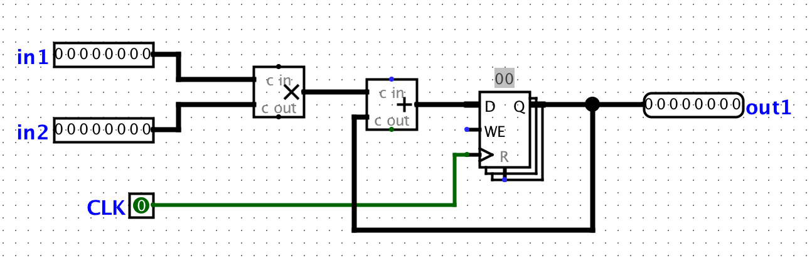

# Конвейеризируй это
Вся работа в этой лабораторной работе будет выполняться с помощью программы моделирования цифровой логики `Logisim Evolution`, из предыдущей работы.

**ВАЖНО: Используйте предоставленный вам файл .jar, и не обновляйте его! И примечание: Logisim не сохраняет вашу работу по мере продвижения, и он не создает бэкапов! Сохраняйтесь при запуске и часто сохраняйтесь во время работы.**

Вы можете открыть Logisim через:
```
java -jar ../lab03/logisim-evolution.jar
```

ВАЖНО: Logisim - это программа на `Java`, для которой требуется графический интерфейс. Убедитесь, что на вашем локальном компьютере установлена `Java`. На компьютерах с `Windows` может потребоваться дополнительная установка `Xming`. В `OSX` вам может потребоваться установить `XQuartz`.

Для `logisim` старых версий есть документация на [русском](http://www.cburch.com/logisim/ru/index.html) и множество туториалов в сети. В работе используется версия новее, но отличие в интерфейсе минимально.

## Задание 1. Неэффективности повсюду
Для этого упражнения мы можем предположить, что регистры изначально имеют нулевое значение. Мы будем использовать лабораторный файл `ex1.circ`, в котором должна быть есть подсхема `non_pipelined` которая выглядит примерно так:


Все, что делает эта схема, это принимает два входа, умножает их вместе, а затем прибавляет результат к текущему значению состояния. Такая операция называется умножение-сложение или Multiply–accumulate operation, MAC-op. Это очень важная операция в таких областях как цифровая обработка сигналов, машинное обучение и других.

Для этой схемы пусть задержка распространения сигнала для блока сумматора составляет 45 нс, а задержка распространения сигнала для блока умножения - 60 нс. Регистр имеет задержку от CLK к Q 10 нс, сигнал на входе регистра должен быть установлен за 10 нс до фронта CLK (время установки, setup time) и должен быть удержан в течение 5 нс (время удержания, hold time). Вычислите максимальную тактовую частоту, с которой может работать эта схема. Предположим, что оба входа поступают из регистров, которые получают синхросигнал из внешнего источника.

### Задача

 * На этом этапе убедитесь, что вы можете рассчитывать тактовую частоту с использованием задержек распространения и находить критический путь в схеме.
 * Будьте готовы продемонстрировать свои расчеты для достижения максимальной тактовой частоты для неконвейерной схемы.

## Задание 2. Разделяй и ускоряй.
Мы хотим улучшить производительность этой схемы и позволить ей работать с более высокой тактовой частотой. Для этого мы хотим иметь в нашем конвейере две стадии: стадию умножения и стадию сложения в указанном порядке.

Чтобы проверить, что ваша конвейерная обработка по-прежнему дает правильные выходные данные, мы будем считать выходы из схемы «правильными» тогда и только тогда, когда они соответствуют последовательности выходов, которые будет выдавать неконвейерная версия, но сдвинутых на несколько нулевых значений, связанных с прогревом конвейера. Например, пусть для некоторой последовательности входных данных, версия без конвейера производит последовательность [3, 5, 1, 2, 4,…]. Тогда правильная конвейерная схема может выдать последовательность [0, 3, 5, 1, 2, 4,…] для той же последовательности входов. Вы можете проверить это, смоделировав схему (используя раскрывающееся меню `Simulate`) и либо вручную прокликав синхросигнал, либо включив непрерывные отсчеты.

В вашем файле `ex1.circ` главная схема настроена на создание выходной последовательности [3, 5, 1, 2, 4, -1, 0, 0,…] из неконвейерной версии схемы. Блоки ROM памяти должны быть инициализированы соответствующими данными, но если что-то пойдет не так, выберите ROM, нажмите `Contents`, нажмите `Open`, затем выберите `Romdata` из файлов в директории с работой.

Обратите внимание, что для конвейерной обработки схемы нам нужен регистр для хранения промежуточного значения вычислений между этапами конвейера. Это общий момент всех конвейеров.

### Задача

 * Завершите конвейерную подсхему. Вам нужно будет добавить регистр, чтобы разделить этапы умножения и сложения.
 * Рассчитайте максимальную тактовую частоту для конвейерной версии схемы, которую вы создали. Будьте готовы объяснить свои рассчеты.
 * В главе 4 учебника `Архитектруа компьютера` обсуждается, что если вычисление зависит от вывода предыдущего вычисления, его сложно конвейерно обработать, и часто приходится вставлять один или несколько конвейерных «простоев» (так же пузырь, bubble), чтобы гарантировать, что вывод первого вычисления готов стать вводом ко второму. Напоминаем, что простой - это процесс преднамеренной задержки инструкции в конвейере. Важно понимать, почему такие простои не нужны именно для данной схемы. Объясните, почему нам не нужны «простои» для нашей конвейерной схемы.

